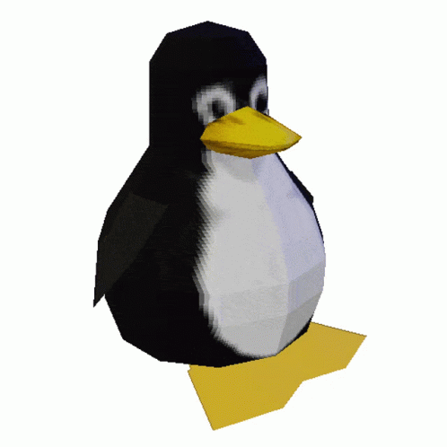

## Programmer

> 🐧 "I use Arch, btw."

## Development Stack

       

- **Editor**: [Neovim](https://neovim.io)
- **Shell**: [fish](https://fishshell.com)
- **Terminal**: [Kitty](https://sw.kovidgoyal.net/kitty/) 
- **OS**: [Arch Linux](https://archlinux.org) with [Hyprland](https://hyprland.org)

## GitHub Stats

  
